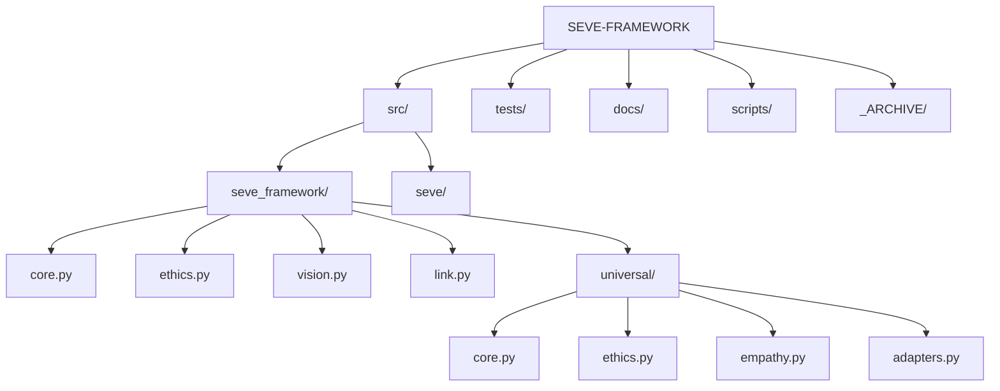

# 🗺️ Mapa Interno do SEVE Framework

**Versão**: 1.0.0-beta (Consolidada)
**Data**: 30 de Novembro de 2025

Este documento serve como o guia definitivo da estrutura interna do SEVE Framework após a consolidação da arquitetura v3.0 e integração dos módulos universais.

---

## 📂 Estrutura de Diretórios

### 📦 `src/` - O Código Fonte

| Diretório/Arquivo | Descrição | Status |
| :--- | :--- | :--- |
| **`seve_framework/`** | **O CORE REAL**. Contém toda a implementação v3.0. | ✅ Ativo |
| `├── core.py` | Orquestrador principal (`SEVECoreV3`). Gerencia o ciclo de vida. | ✅ Ativo |
| `├── ethics.py` | Módulo GuardFlow (`SEVEEthicsModule`). Regras e validação. | ✅ Ativo |
| `├── vision.py` | Visão Computacional (`SEVEVisionModule`). Detecção e privacidade. | ⚠️ Parcial |
| `├── link.py` | Conectividade (`SEVELinkModule`). APIs e transmissão segura. | ✅ Ativo |
| `├── sense.py` | IoT e Sensores (`SEVESenseModule`). | 🚧 WIP |
| `└── universal/` | **Módulo Universal**. Lógica adaptativa avançada. | ✅ Integrado |
| &nbsp;&nbsp;&nbsp;&nbsp;`├── ethics.py` | Motor de Ética Universal (regras globais). | ✅ Migrado |
| &nbsp;&nbsp;&nbsp;&nbsp;`├── empathy.py` | Análise de Empatia e Sentimento. | ✅ Migrado |
| &nbsp;&nbsp;&nbsp;&nbsp;`└── adapters.py` | Adaptadores de Domínio (Saúde, Varejo, etc). | ✅ Migrado |
| **`seve/`** | **ALIAS DE COMPATIBILIDADE**. Redireciona imports para `seve_framework`. | 🔗 Ponte |

### 🗑️ `_ARCHIVE/` - O Passado

| Diretório | Descrição | Ação Recomendada |
| :--- | :--- | :--- |
| `src_seve_v1_legacy` | Código antigo da versão 1.0. | Manter como referência |
| `legacy_repo_content` | Código fonte original de onde o Universal foi extraído. | Manter como backup |
| `recursive_clone_backup` | Cópia redundante do repo que estava aninhada. | Pode ser deletado |

---

## 🔄 Fluxo de Dados e Decisão

O framework opera em um pipeline sequencial com validação ética interceptora.

1.  **Input** (Visão, Sensor, API) entra no sistema.
2.  **`SEVECoreV3`** recebe o contexto e normaliza os dados.
3.  **`SEVEVisionModule`** (se visual) processa e aplica **Privacidade** (anonymization).
4.  **`SEVEEthicsModule`** (GuardFlow) intercepta a decisão:
    *   Consulta **`UniversalEthicsEngine`** para princípios globais.
    *   Verifica regras específicas do domínio.
    *   **BLOQUEIA** se violar princípios críticos (ex: privacidade, viés).
5.  **`SEVELinkModule`** transmite o resultado apenas se aprovado eticamente.

---

## 📍 Onde Encontrar...

### ...as Regras Éticas?
*   **Regras do GuardFlow**: `src/seve_framework/ethics.py` (Classe `EthicalRule`)
*   **Princípios Universais**: `src/seve_framework/universal/ethics.py` (Classe `UniversalEthicsEngine`)

### ...a Configuração de Privacidade?
*   **Configuração**: `src/seve_framework/config.py`
*   **Implementação de Anonimização**: `src/seve_framework/vision.py` (Método `_anonymize_region`)

### ...os Adaptadores de Domínio?
*   **Implementação**: `src/seve_framework/universal/adapters.py`
*   **Registro**: `src/seve_framework/universal/core.py`

---

## 🛠️ Ferramentas de Manutenção

*   **Verificar Instalação**: `scripts/diagnose_imports.py`
*   **Testar Fluxo Ético**: `scripts/verify_e2e_flow.py`
*   **Gerar Documentação**: `scripts/generate_docs.py` (Planejado)

---

Este mapa deve ser atualizado sempre que houver mudanças estruturais significativas.
