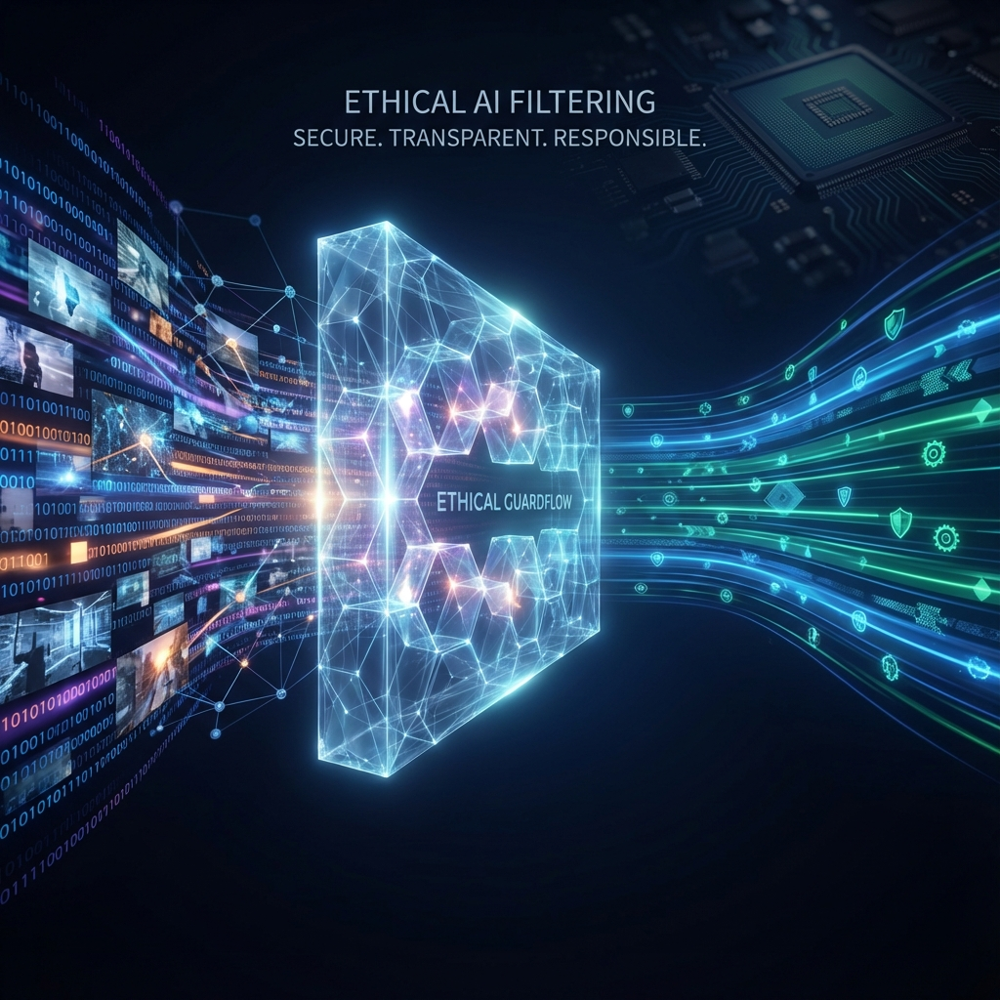
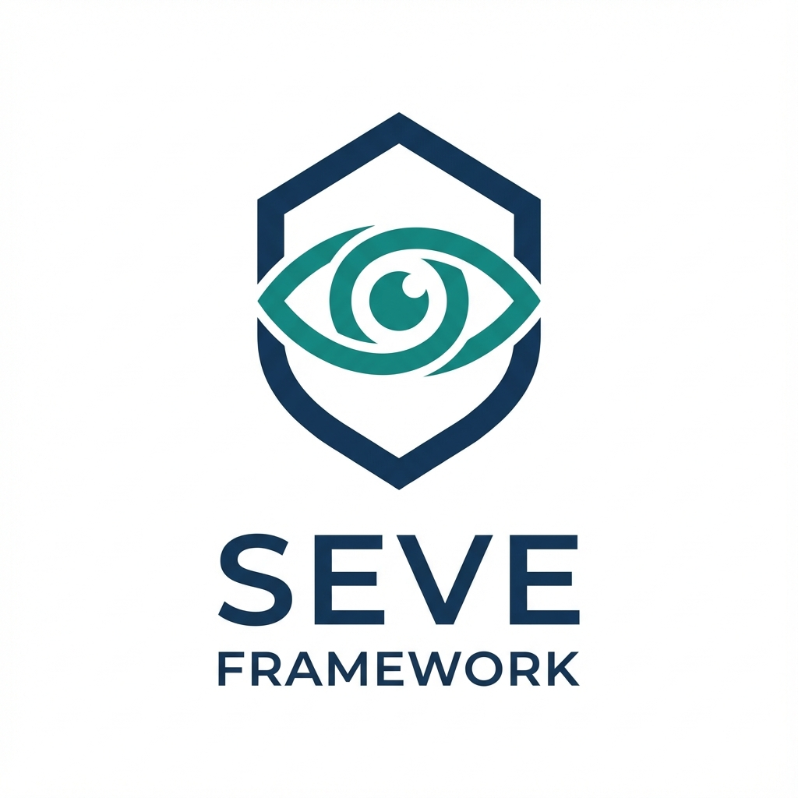
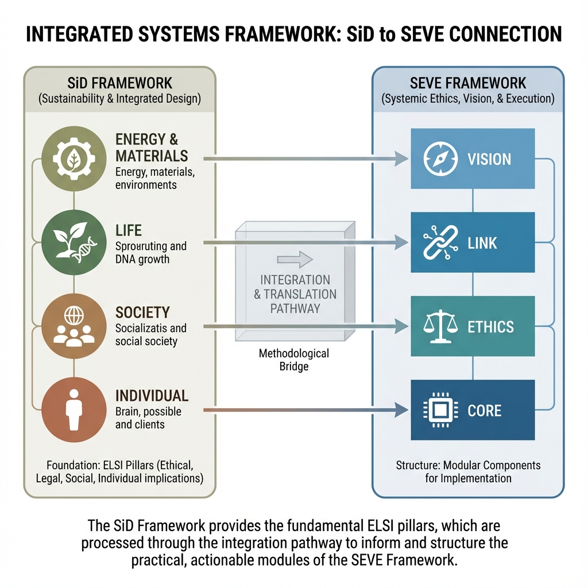
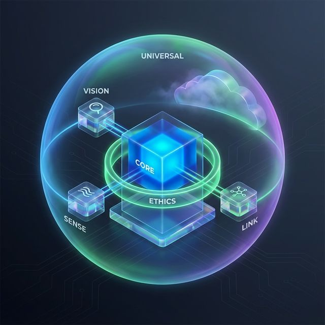

<p align="center">
  
</p>

<h1 align="center">SEVE Framework</h1>
<h3 align="center">Symbiotic Ethical Vision Engine v1.0-beta</h3>
<p align="center"><strong>Framework Core de IA Ética, Adaptativa e Descentralizada</strong></p>

<p align="center">
  <a href="https://github.com/symbeon/seve-framework"></a>
  <a href="LICENSE_Symbeon_Vault.md"></a>
  <a href="https://www.python.org/downloads/"></a>
  <a href="https://github.com/symbeon/seve-framework"></a>
  <a href="tests/"></a>
  <a href="docs/"></a>
</p>

---

## 🚧 **Status de Desenvolvimento**

> **⚠️ IMPORTANTE**: Este framework está atualmente em fase **BETA/DESENVOLVIMENTO ATIVO**.

### Estado Atual dos Módulos

| Módulo | Status | Implementação |
|--------|--------|---------------|
| **SEVE-Core** | 🟡 Beta | Arquitetura completa, algoritmos em desenvolvimento |
| **SEVE-Ethics** | 🟡 Beta | GuardFlow funcional, algoritmos em expansão |
| **SEVE-Vision** | 🟡 Beta | Estrutura base, modelos em treinamento |
| **SEVE-Empathy** | 🟡 Beta | Implementação avançada integrada |
| **SEVE-Sense** | 🟡 Beta | Placeholder, necessita implementação |
| **SEVE-Link** | 🟡 Beta | Estrutura base presente |
| **SEVE-Universal** | ✅ Integrado | Migrado do legacy, funcional |

### Prontidão para Produção

- ✅ **Arquitetura**: Completa e validada
- ✅ **Princípios Éticos**: Definidos e documentados
- ✅ **Licenciamento**: Completo com cláusulas éticas
- 🟡 **Implementação Core**: 60% completa
- 🟡 **Testes**: 45% cobertura (em expansão)
- ❌ **Auditoria Externa**: Pendente
- ❌ **Certificações**: Planejadas para 2026

**Recomendação Atual**: 
- ✅ Adequado para: Pesquisa, POCs, Desenvolvimento, Prototipagem
- ⚠️ Em preparação para: Casos de uso comerciais (Q1 2026)
- ❌ Não recomendado ainda para: Produção com dados sensíveis reais

### Roadmap v1.0.0 Production-Ready

- **Sprint 1 (Dez 2025)**: Completar implementações core
- **Sprint 2 (Jan 2026)**: Testes completos + coverage >80%
- **Sprint 3 (Fev 2026)**: Auditoria externa + segurança
- **Lançamento v1.0.0**: Março 2026

---

## 🎯 **Sobre o Framework**

O **SEVE Framework** é um framework universal de IA ética que combina **Inteligência Artificial**, **Visão Computacional**, **Ética Automatizada** e **Blockchain** para criar sistemas inteligentes responsáveis, privados e descentralizados.

### **Fundação Filosófica: SiD ↔ SEVE**

O SEVE Framework é a **tradução computacional** e **extensão tecnológica** do **SiD Framework** (Symbiosis in Development), estabelecido desde 1999. O SEVE atua como o motor operacional que materializa os princípios de sustentabilidade holística do SiD através de ações tecnológicas mensuráveis e auditáveis.



#### Simetria Funcional

O SEVE traduz os princípios ontológicos do SiD em módulos tecnológicos operacionais:

| SiD (Conceito ELSI) | SEVE (Tecnologia) | Tradução |
|---------------------|-------------------|----------|
| **Energy & Materials (E)** | SEVE-Vision + SEVE-Sense | Captura de dados físicos e fluxos de energia |
| **Life (L)** | SEVE-Link | Interconexão orgânica entre sistemas (IoT/Blockchain) |
| **Society (S)** | SEVE-Ethics | Governança algorítmica e conformidade ética |
| **Individual (I)** | SEVE-Core | Consciência funcional e experiência personalizada |

📖 **Documentação Completa**: [SiD-SEVE Integration](docs/SID_SEVE_INTEGRATION.md)

---

## 🏗️ **Arquitetura Modular**



```
SEVE-Core (Orquestrador Central)
├── SEVE-Vision (Detecção Multi-Modal com Privacidade)
├── SEVE-Ethics (GuardFlow - Compliance ESG/LGPD)
├── SEVE-Empathy (Análise Emocional e Sentimento)
├── SEVE-Sense (Sensores IoT e Dados Multimodais)
├── SEVE-Link (Conectividade Segura e Blockchain)
└── SEVE-Universal (Adaptação de Domínio)
    ├── Healthcare Adapter
    ├── Retail Adapter
    ├── Education Adapter
    └── Custom Domain Adapters
```

📖 **Mapa Interno**: [INTERNAL_ARCHITECTURE_MAP.md](INTERNAL_ARCHITECTURE_MAP.md)

---

## 🚀 **Instalação**

```bash
# Clone o repositório
git clone https://github.com/symbeon/seve-framework.git
cd seve-framework

# Instale as dependências
pip install -r requirements.txt

# Ou via pip (quando disponível)
pip install seve-framework
```

---

## 💻 **Uso Básico**

```python
from seve_framework import SEVECoreV3, SEVEConfig, EthicsLevel
from seve_framework.ethics import SEVEEthicsModule

# Configurar framework
config = SEVEConfig(
    ethics_level=EthicsLevel.STRICT,
    guardflow_enabled=True
)

# Inicializar core
core = SEVECoreV3(config)
await core.initialize()

# Processar contexto com validação ética automática
result = await core.process_context(transaction_data, context)

# Verificar resultado ético
if result.status == "ethics_blocked":
    print(f"Transação bloqueada: {result.reason}")
else:
    print(f"Transação aprovada: {result.data}")
```

---

## 📚 **Documentação Técnica**

Este repositório contém a documentação técnica completa do framework:

- **`docs/technical/`** - Arquitetura técnica detalhada
# Testes com cobertura
pytest --cov=seve_framework

# Teste E2E do fluxo ético
python scripts/verify_e2e_flow.py

# Diagnóstico de ambiente
python scripts/diagnose_imports.py
```

**Status atual**: 45% de cobertura (meta: >80% para v1.0.0)

---

## 🤝 **Contribuindo**

Contribuições são bem-vindas! Por favor, leia [CONTRIBUTING.md](CONTRIBUTING.md) para detalhes sobre nosso código de conduta e processo de submissão de pull requests.

**Áreas que precisam de contribuição**:
- Implementação de algoritmos de detecção de viés
- Completar módulos SEVE-Sense
- Expandir cobertura de testes
- Documentação de casos de uso

---

## 📄 **Licença**

Este projeto está licenciado sob a **Licença Symbeon Vault** - veja o arquivo [LICENSE_Symbeon_Vault.md](LICENSE_Symbeon_Vault.md) para detalhes.

A licença Symbeon-Vault é baseada em Apache 2.0 com cláusulas éticas adicionais que proíbem:
- Vigilância em massa
- Práticas discriminatórias
- Extração de dados sem consentimento
- Violações de direitos humanos

---

## 🌐 **Ecossistema Symbeon**

O SEVE Framework é o núcleo tecnológico do **Symbeon Ecosystem**, que inclui:

- **Frontend/Showcase**: Interface web e marketplace
- **Backend Services**: APIs em Rust e Python
- **Smart Contracts**: Contratos blockchain para certificação
- **Documentação Completa**: Guias de produto e deploy

Visite o repositório completo: **[symbeon-ecosystem](https://github.com/symbeon/symbeon-ecosystem)**

---

## 📞 **Contato**

- **Website**: [symbeon.tech](https://symbeon.tech)
- **Email**: contato@symbeon.tech
- **GitHub**: [@symbeon](https://github.com/symbeon)

---

## 📋 **Auditoria e Transparência**

Este framework passou por auditoria de segurança e ética em Novembro de 2025.

**Resultados**:
- Score Ético: 8.1/10 ⭐⭐⭐⭐
- Score de Segurança: 80/100
- Status: Excelente arquitetura, implementação em progresso

Veja relatórios completos em:
- [Auditoria Completa](AUDITORIA_COMPLETA_SEVE_FRAMEWORK.md)
- [Sumário Executivo](SUMARIO_EXECUTIVO_AUDITORIA.md)
- [Checklist de Ações](CHECKLIST_ACOES_IMEDIATAS.md)

---

<p align="center">
  <strong>SEVE Framework</strong><br>
  Tecnologia com Propósito • Ética por Design • Impacto Real
</p>