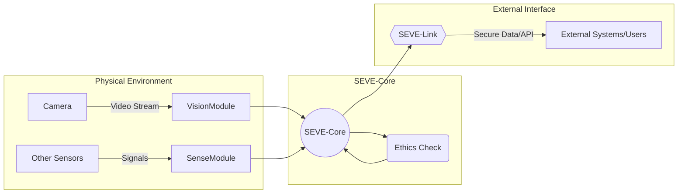
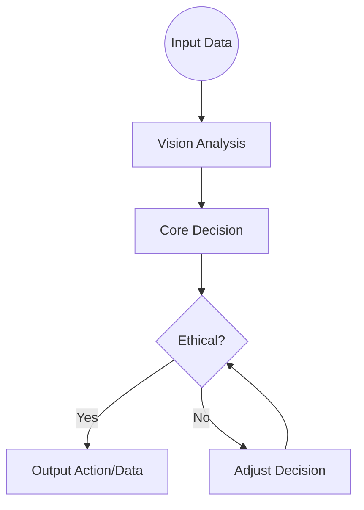

# SEVE Framework v3.0 - README Institucional

## 🎯 **Visão Geral**

O **SEVE Framework v3.0** (Symbiotic Ethical Vision Engine) é um projeto de código aberto da Symbeon Tech que oferece um motor de visão computacional modular e focado em ética. O SEVE integra IA avançada de visão com um módulo de ética embutido para garantir que todas as operações e saídas estejam alinhadas com diretrizes de privacidade e ética.

Este README fornece uma visão geral da visão do SEVE, compromissos éticos, instruções de uso e diretrizes de contribuição para desenvolvedores e organizações interessadas em implantar ou estender este framework.

## 📜 **Manifesto Ético**

Na Symbeon Tech, acreditamos que a tecnologia deve amplificar o potencial humano enquanto defende os valores humanos. O SEVE Framework nasce dessa convicção. Nosso Manifesto Ético para o SEVE enfatiza os seguintes princípios fundamentais:

### **Privacidade por Design**
O SEVE é construído para proteger a privacidade individual. Todos os dados pessoais (rostos, identidades, placas de veículos, etc.) processados através do sistema de visão são tratados com cuidado – seja anonimizados, pseudonimizados ou protegidos de outra forma. O framework não produz informações pessoais sensíveis a menos que explicitamente configurado para fazê-lo sob consentimento apropriado ou base legal.

### **IA Justa e Sem Viés**
Os algoritmos e regras de decisão do SEVE são desenvolvidos e testados para minimizar viés. Buscamos justiça entre demografias – o módulo ético (SEVE-Ethics) verifica ativamente e mitiga resultados tendenciosos.

### **Transparência e Explicabilidade**
As decisões tomadas pelo SEVE estão sujeitas a auditoria. O sistema pode fornecer explicações para suas ações (ex: por que um alerta foi emitido ou por que uma saída foi mascarada pelo filtro ético).

### **Design Centrado no Humano e Simbiótico**
O SEVE não é uma caixa preta autônoma – é uma ferramenta projetada para trabalhar em conjunto com operadores humanos e tomadores de decisão.

### **Sem Uso Prejudicial**
Sob a licença Symbeon-Vault, o SEVE vem com uma expectativa de uso responsável. Desencorajamos e proibimos explicitamente usos do SEVE que contribuam para violações de direitos humanos, vigilância ilegal ou qualquer forma de dano a indivíduos ou comunidades.

## 🏗️ **Visão Técnica**

A visão técnica do SEVE Framework v3.0 é fornecer uma plataforma abrangente, modular e escalável para aplicações de visão computacional ética. Aspectos-chave de nossa abordagem técnica incluem:

### **Arquitetura Modular**
O SEVE é organizado em módulos distintos – Vision (processamento ótico), Sense (sensores adicionais), Core (motor de decisão), Ethics (supervisão ética) e Link (conectividade/API).

### **IA de Visão de Estado da Arte**
O módulo SEVE-Vision implementa técnicas de visão computacional de ponta (redes neurais profundas para detecção de objetos, reconhecimento, etc.).

### **Fusão Sensorial em Tempo Real**
O SEVE-Core pode lidar com fluxos de dados em tempo real, fundindo dados visuais com outras entradas de sensores.

### **Proteções Éticas Integradas**
O SEVE-Ethics é um componente de primeira classe, não uma reflexão tardia. Tecnicamente, é implementado como um motor baseado em regras com capacidade de impor restrições nas saídas do SEVE-Core.

### **API Pública e Integração**
O módulo SEVE-Link fornece meios para integrar o SEVE em sistemas maiores. Inclui opções para uma API RESTful ou comunicação baseada em mensagens.

## 🚀 **Instalação**

### **Pré-requisitos**
O SEVE Framework é implementado principalmente em Python (com algumas extensões C/C++ para componentes críticos de performance). Certifique-se de ter Python 3.8+ instalado em seu sistema.

### **Passos para Instalar e Executar o SEVE**

1. **Obter o Código Fonte**
```bash
git clone https://github.com/symbeon-tech/seve-framework.git
cd seve-framework
```

2. **Configurar Ambiente**
```bash
python3 -m venv venv
source venv/bin/activate
pip install --upgrade pip
```

3. **Instalar Dependências**
```bash
pip install -r requirements.txt
```

4. **Configurar Configurações**
Antes de executar o SEVE, revise o arquivo de configuração (`config/seve_config.yaml`).

5. **Executar o Framework**
```bash
python run_seve.py --demo
```

## 📖 **Uso e API Pública**

### **Modo Standalone**
Neste modo, o SEVE executa e gerencia entrada/saída internamente.

### **Modo Biblioteca/SDK**
Você pode usar o SEVE como uma biblioteca Python:
```python
from seve.core import SeveCore
core = SeveCore(config="config/seve_config.yaml")
results = core.process_image("test.jpg")
```

### **Modo API RESTful**
Quando o recurso de API do SEVE-Link está habilitado, o SEVE executa um serviço web que aplicações externas podem chamar.

**Endpoints principais:**
- `GET /status` – retorna heartbeat de status
- `POST /api/v1/analyze` – aceita uma imagem e retorna resultados processados eticamente
- `POST /api/v1/command` – permite enviar comandos de controle

## 📁 **Estrutura do Projeto**

```
src/                    # Código-fonte organizado por módulo
├── core/              # Lógica de orquestração e decisão central
├── vision/            # Processamento de visão (definições de modelo, utils de imagem)
├── sense/             # Componentes de manipulação de sensores
├── ethics/            # Implementação do motor de regras éticas
└── link/              # Servidor API e lógica de conectividade

models/                # Pesos de modelos pré-treinados ou definições
config/                # Arquivos de configuração padrão
docs/                  # Documentação adicional
examples/              # Scripts de exemplo e notebooks Jupyter
scripts/               # Scripts utilitários
tests/                 # Testes unitários e de integração
.vault/                # Elementos de segurança/ética
├── ethics_policies.yaml
└── pseudonym_keys.json
```

## 📄 **Licenciamento**

O SEVE Framework v3.0 é lançado sob a Licença Symbeon-Vault, que é baseada na Licença Apache 2.0 e inclui cláusulas adicionais para uso ético e privacidade (pseudonimato).

### **Resumo da Licença:**
- Você é livre para usar, modificar, distribuir e construir sobre este software para fins comerciais ou não comerciais sob as condições da Apache 2.0
- **Termos Adicionais Symbeon-Vault**: Ao usar o SEVE, você concorda em usá-lo eticamente e manter proteções de privacidade

## 🤝 **Contribuindo**

Acolhemos calorosamente contribuições para o SEVE Framework! Ao contribuir, você concorda em licenciar suas contribuições sob a mesma Licença Symbeon-Vault.

### **Como Contribuir:**
1. **Reportar Problemas**: Abra uma issue no GitHub
2. **Enviar Pull Requests**: Fork o repositório e crie uma nova branch
3. **Solicitações de Recursos**: Inicie uma discussão para ideias maiores
4. **Comunidade**: Participe da conversa em nosso canal Gitter/Slack

## 🏢 **Aplicações Industriais e Comerciais**

O SEVE Framework v3.0 tem amplo potencial de aplicações em diversos setores industriais e comerciais:

- **Cidades Inteligentes e Vigilância Urbana**
- **Transporte Autônomo e Veículos Inteligentes**
- **Segurança do Trabalho e Indústria 4.0**
- **Saúde e Bem-Estar**
- **Varejo e Espaços Comerciais**
- **Setor Financeiro e Acesso Seguro**

## 📊 **Diagramas de Arquitetura**

### **Arquitetura Modular do SEVE**


### **Fluxo de Salvaguarda Ética (GuardFlow)**


## 🎯 **Conclusão**

O SEVE Framework v3.0 representa uma abordagem revolucionária para visão computacional ética, combinando tecnologia avançada com princípios morais fundamentais. Ao integrar proteções éticas diretamente na arquitetura do sistema, o SEVE oferece uma base sólida para aplicações de IA responsáveis e confiáveis.

### **Diferenciais Únicos**
- **Ética Integrada**: Proteções éticas desde o design
- **Modularidade**: Arquitetura flexível e extensível
- **Transparência**: Decisões auditáveis e explicáveis
- **Privacidade**: Proteção de dados por design
- **Simbiose**: Colaboração humano-IA

### **Visão de Futuro**
O SEVE Framework será o padrão de referência para visão computacional ética, influenciando pesquisas futuras e aplicações industriais em múltiplos domínios, sempre mantendo os princípios fundamentais de **ética, transparência e responsabilidade**.

---

**SEVE Framework v3.0** - *Visão Computacional Ética Simbiótica* 🌍🤖⚡

**Desenvolvido pela Symbeon Tech - Equipe EON**
