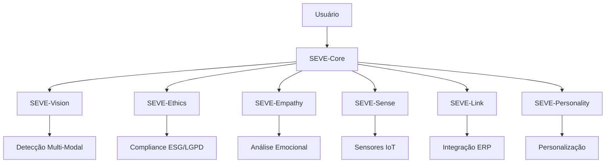
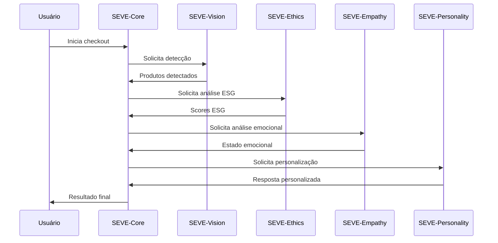
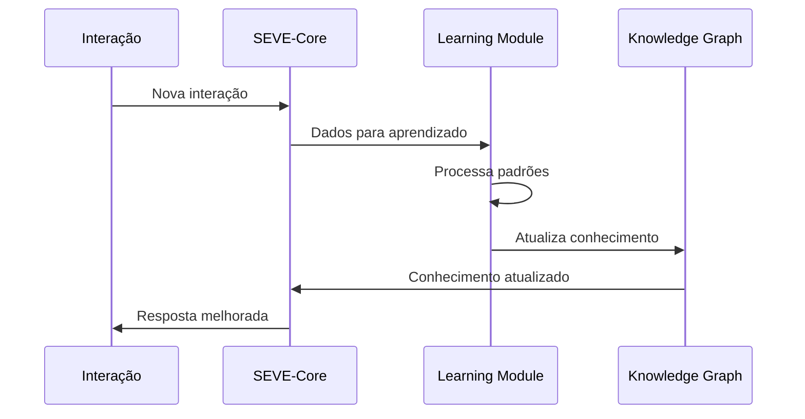

# SEVE Framework - Arquitetura Técnica

## 🏗️ **ARQUITETURA GERAL**

O SEVE Framework é construído com uma arquitetura modular e extensível, permitindo integração flexível e escalabilidade horizontal.



## 🔧 **COMPONENTES DETALHADOS**

### **SEVE-Core (Núcleo)**

#### **Responsabilidades:**
- Orquestração de componentes
- Knowledge Graph de produtos
- Motor de inferência ESG
- Gerenciamento de contexto
- Aprendizado contínuo

#### **Arquitetura Interna:**
```python
class SEVECore:
    def __init__(self):
        self.knowledge_graph = ProductKnowledgeGraph()
        self.esg_engine = ESGCalculationEngine()
        self.inference_engine = HybridInferenceEngine()
        self.learning_module = ContinuousLearningModule()
        self.context_manager = ContextManager()
```

#### **Fluxo de Processamento:**
1. **Recepção**: Recebe dados de múltiplos componentes
2. **Integração**: Combina dados em contexto unificado
3. **Inferência**: Aplica algoritmos de inferência
4. **Aprendizado**: Atualiza conhecimento baseado em feedback
5. **Resposta**: Retorna resultado processado

### **SEVE-Vision (Visão)**

#### **Responsabilidades:**
- Detecção de código de barras e QR
- Reconhecimento visual de produtos
- Validação por peso
- Detecção de anomalias
- Classificação multi-modal

#### **Arquitetura Interna:**
```python
class SEVEVision:
    def __init__(self):
        self.barcode_scanner = BarcodeScanner()
        self.qr_reader = QRCodeReader()
        self.visual_classifier = ProductVisualClassifier()
        self.weight_validator = WeightValidationSystem()
        self.anomaly_detector = AnomalyDetectionEngine()
```

#### **Pipeline de Detecção:**
1. **Captura**: Recebe stream de imagem
2. **Preprocessamento**: Normaliza e otimiza imagem
3. **Detecção Multi-Modal**: Aplica múltiplos algoritmos
4. **Fusão**: Combina resultados de diferentes métodos
5. **Validação**: Confirma detecção com sensores
6. **Classificação**: Identifica produto final

### **SEVE-Ethics (Ética)**

#### **Responsabilidades:**
- Verificação automática ESG
- Proteção de dados LGPD
- Auditoria transparente
- Detecção de vieses
- Relatórios de compliance

#### **Arquitetura Interna:**
```python
class SEVEEthics:
    def __init__(self):
        self.esg_compliance = ESGComplianceEngine()
        self.lgpd_protection = LGPDProtectionModule()
        self.audit_logger = EthicalAuditLogger()
        self.bias_detector = BiasDetectionSystem()
        self.report_generator = ComplianceReportGenerator()
```

#### **Pipeline de Compliance:**
1. **Análise ESG**: Calcula scores ambientais, sociais, governança
2. **Verificação LGPD**: Valida proteção de dados
3. **Detecção de Vieses**: Identifica preconceitos algorítmicos
4. **Auditoria**: Registra todas as decisões
5. **Relatório**: Gera documentação de compliance

### **SEVE-Empathy (Empatia)**

#### **Responsabilidades:**
- Detecção de estados emocionais
- Análise comportamental
- Geração de respostas empáticas
- Suporte contextual
- Adaptação emocional

#### **Arquitetura Interna:**
```python
class SEVEEmpathy:
    def __init__(self):
        self.emotion_detector = EmotionDetector()
        self.context_analyzer = ContextAnalyzer()
        self.response_generator = EmpatheticResponseGenerator()
        self.behavior_analyzer = BehaviorAnalyzer()
        self.empathy_engine = EmpathyEngine()
```

#### **Pipeline Emocional:**
1. **Captura**: Coleta sinais emocionais (texto, comportamento)
2. **Análise**: Processa sinais com NLP e ML
3. **Fusão**: Combina múltiplas fontes de informação
4. **Classificação**: Identifica estado emocional
5. **Resposta**: Gera resposta empática apropriada

### **SEVE-Sense (Sensores)**

#### **Responsabilidades:**
- Integração com sensores IoT
- Fusão de dados multi-sensor
- Monitoramento ambiental
- Detecção de segurança
- Calibração automática

#### **Arquitetura Interna:**
```python
class SEVESense:
    def __init__(self):
        self.weight_sensors = WeightSensorArray()
        self.motion_sensors = MotionDetectionSystem()
        self.environmental_sensors = EnvironmentalMonitoring()
        self.security_sensors = SecurityDetectionSystem()
        self.data_fusion = DataFusionEngine()
```

#### **Pipeline de Sensores:**
1. **Coleta**: Lê dados de todos os sensores
2. **Preprocessamento**: Filtra e normaliza dados
3. **Fusão**: Combina dados de múltiplos sensores
4. **Análise**: Detecta padrões e anomalias
5. **Validação**: Confirma dados com contexto

### **SEVE-Link (Integração)**

#### **Responsabilidades:**
- Conectividade com ERPs
- API Gateway unificado
- Sincronização em tempo real
- Gerenciamento de webhooks
- Integração de sistemas externos

#### **Arquitetura Interna:**
```python
class SEVELink:
    def __init__(self):
        self.erp_connector = ERPConnector()
        self.api_gateway = APIGateway()
        self.data_sync = DataSynchronizationEngine()
        self.webhook_manager = WebhookManager()
        self.connection_pool = ConnectionPool()
```

#### **Pipeline de Integração:**
1. **Conexão**: Estabelece conexão com ERP
2. **Mapeamento**: Mapeia dados para formato ERP
3. **Sincronização**: Envia/recebe dados
4. **Validação**: Confirma integridade dos dados
5. **Notificação**: Informa stakeholders via webhook

### **SEVE-Personality (Personalidade)**

#### **Responsabilidades:**
- Criação de perfis de personalidade
- Adaptação comportamental
- Aprendizado de preferências
- Personalização de experiência
- Evolução contínua

#### **Arquitetura Interna:**
```python
class SEVEPersonality:
    def __init__(self):
        self.profile_manager = PersonalityProfileManager()
        self.adaptation_engine = AdaptationEngine()
        self.learning_system = PersonalityLearningSystem()
        self.preference_analyzer = PreferenceAnalyzer()
        self.evolution_engine = PersonalityEvolutionEngine()
```

#### **Pipeline de Personalização:**
1. **Análise**: Analisa comportamento e preferências
2. **Classificação**: Determina tipo de personalidade
3. **Adaptação**: Ajusta comportamento baseado no perfil
4. **Aprendizado**: Atualiza perfil com novas interações
5. **Evolução**: Refina personalidade ao longo do tempo

## 🔄 **FLUXOS DE DADOS**

### **Fluxo Principal de Checkout:**



### **Fluxo de Aprendizado:**



## 📊 **PADRÕES DE DESIGN**

### **1. Modularidade**
- Componentes independentes
- Interfaces bem definidas
- Baixo acoplamento
- Alta coesão

### **2. Extensibilidade**
- Plugin architecture
- Hot-swappable components
- Configuration-driven behavior
- API-first design

### **3. Escalabilidade**
- Horizontal scaling
- Load balancing
- Caching strategies
- Database sharding

### **4. Observabilidade**
- Comprehensive logging
- Metrics collection
- Distributed tracing
- Health monitoring

## 🔒 **SEGURANÇA E PRIVACIDADE**

### **Proteção de Dados:**
- Criptografia end-to-end
- Anonimização de dados
- Consentimento granular
- Auditoria completa

### **Segurança de Sistema:**
- Autenticação multi-fator
- Autorização baseada em roles
- Rate limiting
- Input validation

### **Compliance:**
- LGPD compliance
- GDPR compliance
- SOC 2 Type II
- ISO 27001

## 🚀 **DEPLOYMENT E OPERAÇÕES**

### **Containerização:**
- Docker containers
- Kubernetes orchestration
- Service mesh (Istio)
- Auto-scaling

### **Monitoramento:**
- Prometheus metrics
- Grafana dashboards
- ELK stack logging
- AlertManager notifications

### **CI/CD:**
- GitLab CI/CD
- Automated testing
- Blue-green deployment
- Rollback capabilities

---

**Arquitetura SEVE** - *Design Modular, Escalável e Ético* 🏗️⚡🔒
