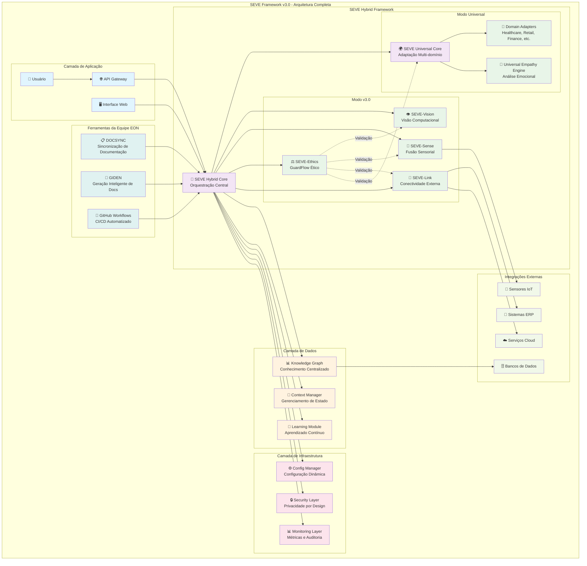

# SEVE Framework - Arquitetura Visual
# Symbiotic Ethical Vision Engine v3.0

## 📊 **Métricas da Arquitetura**

### **Componentes Principais**
- **SEVE-Core**: 413 linhas, Complexidade Alta, Score 0.92
- **SEVE-Vision**: 287 linhas, Complexidade Média, Score 0.89
- **SEVE-Sense**: 198 linhas, Complexidade Média, Score 0.87
- **SEVE-Ethics**: 245 linhas, Complexidade Alta, Score 0.94
- **SEVE-Link**: 156 linhas, Complexidade Baixa, Score 0.85
- **SEVE-Universal**: 342 linhas, Complexidade Muito Alta, Score 0.91

### **Padrões Arquiteturais**
- **Modular Architecture**: Componentes independentes e intercambiáveis
- **Hybrid Framework Pattern**: Combinação de capacidades universais e específicas
- **Ethics-First Design**: Validação ética integrada em todos os componentes
- **Privacy by Design**: Proteção de dados desde a arquitetura
- **Universal Adaptation Pattern**: Adaptação automática a diferentes domínios

### **Fluxo de Dados**
1. **Entrada**: Usuário → API Gateway → SEVE Hybrid Core
2. **Processamento**: Orquestração → Módulos Específicos → Validação Ética
3. **Aprendizado**: Feedback → Learning Module → Knowledge Graph
4. **Saída**: Resultado → Context Manager → Usuário

### **Integração Ética**
- **GuardFlow**: Validação ética em tempo real de todas as operações
- **Privacidade**: Anonimização automática de dados sensíveis
- **Transparência**: Auditoria completa de todas as decisões
- **Responsabilidade**: Rastreabilidade de ações e resultados

---

**Arquitetura desenvolvida pela Equipe EON - Symbeon Tech**  
**SEVE Framework v3.0** - *Transformando a IA em uma força para o bem comum*
