# SEVE Framework - Arquitetura Visual
# Symbiotic Ethical Vision Engine v3.0

```mermaid
graph TB
    subgraph "SEVE Framework v3.0 - Arquitetura Completa"
        subgraph "Camada de Aplicação"
            User[👤 Usuário]
            API[🌐 API Gateway]
            WebUI[🖥️ Interface Web]
        end
        
        subgraph "SEVE Hybrid Framework"
            HybridCore[🧠 SEVE Hybrid Core<br/>Orquestração Central]
            
            subgraph "Modo Universal"
                UniversalCore[🌍 SEVE Universal Core<br/>Adaptação Multi-domínio]
                DomainAdapters[🔧 Domain Adapters<br/>Healthcare, Retail, Finance, etc.]
                EmpathyEngine[💝 Universal Empathy Engine<br/>Análise Emocional]
            end
            
            subgraph "Modo v3.0"
                VisionModule[👁️ SEVE-Vision<br/>Visão Computacional]
                SenseModule[📡 SEVE-Sense<br/>Fusão Sensorial]
                EthicsModule[⚖️ SEVE-Ethics<br/>GuardFlow Ético]
                LinkModule[🔗 SEVE-Link<br/>Conectividade Externa]
            end
        end
        
        subgraph "Camada de Dados"
            KnowledgeGraph[📊 Knowledge Graph<br/>Conhecimento Centralizado]
            ContextManager[🎯 Context Manager<br/>Gerenciamento de Estado]
            LearningModule[🧠 Learning Module<br/>Aprendizado Contínuo]
        end
        
        subgraph "Camada de Infraestrutura"
            ConfigManager[⚙️ Config Manager<br/>Configuração Dinâmica]
            SecurityLayer[🔒 Security Layer<br/>Privacidade por Design]
            MonitoringLayer[📊 Monitoring Layer<br/>Métricas e Auditoria]
        end
        
        subgraph "Ferramentas da Equipe EON"
            DOCSYNC[📋 DOCSYNC<br/>Sincronização de Documentação]
            GIDEN[🤖 GIDEN<br/>Geração Inteligente de Docs]
            Workflows[🔄 GitHub Workflows<br/>CI/CD Automatizado]
        end
        
        subgraph "Integrações Externas"
            ERP[🏢 Sistemas ERP]
            IoT[📱 Sensores IoT]
            Cloud[☁️ Serviços Cloud]
            Databases[🗄️ Bancos de Dados]
        end
    end
    
    %% Conexões principais
    User --> API
    API --> HybridCore
    WebUI --> HybridCore
    
    HybridCore --> UniversalCore
    HybridCore --> VisionModule
    HybridCore --> SenseModule
    HybridCore --> EthicsModule
    HybridCore --> LinkModule
    
    UniversalCore --> DomainAdapters
    UniversalCore --> EmpathyEngine
    
    %% Conexões de dados
    HybridCore --> KnowledgeGraph
    HybridCore --> ContextManager
    HybridCore --> LearningModule
    
    %% Conexões de infraestrutura
    HybridCore --> ConfigManager
    HybridCore --> SecurityLayer
    HybridCore --> MonitoringLayer
    
    %% Conexões externas
    LinkModule --> ERP
    SenseModule --> IoT
    LinkModule --> Cloud
    KnowledgeGraph --> Databases
    
    %% Ferramentas EON
    DOCSYNC --> HybridCore
    GIDEN --> HybridCore
    Workflows --> HybridCore
    
    %% Fluxo de dados éticos
    EthicsModule -.->|Validação| VisionModule
    EthicsModule -.->|Validação| SenseModule
    EthicsModule -.->|Validação| LinkModule
    EthicsModule -.->|Validação| UniversalCore
    
    %% Estilos
    classDef userLayer fill:#e1f5fe
    classDef coreLayer fill:#f3e5f5
    classDef moduleLayer fill:#e8f5e8
    classDef dataLayer fill:#fff3e0
    classDef infraLayer fill:#fce4ec
    classDef eonLayer fill:#e0f2f1
    classDef externalLayer fill:#f1f8e9
    
    class User,API,WebUI userLayer
    class HybridCore,UniversalCore coreLayer
    class VisionModule,SenseModule,EthicsModule,LinkModule,DomainAdapters,EmpathyEngine moduleLayer
    class KnowledgeGraph,ContextManager,LearningModule dataLayer
    class ConfigManager,SecurityLayer,MonitoringLayer infraLayer
    class DOCSYNC,GIDEN,Workflows eonLayer
    class ERP,IoT,Cloud,Databases externalLayer
```

## 📊 **Métricas da Arquitetura**

### **Componentes Principais**
- **SEVE-Core**: 413 linhas, Complexidade Alta, Score 0.92
- **SEVE-Vision**: 287 linhas, Complexidade Média, Score 0.89
- **SEVE-Sense**: 198 linhas, Complexidade Média, Score 0.87
- **SEVE-Ethics**: 245 linhas, Complexidade Alta, Score 0.94
- **SEVE-Link**: 156 linhas, Complexidade Baixa, Score 0.85
- **SEVE-Universal**: 342 linhas, Complexidade Muito Alta, Score 0.91

### **Padrões Arquiteturais**
- **Modular Architecture**: Componentes independentes e intercambiáveis
- **Hybrid Framework Pattern**: Combinação de capacidades universais e específicas
- **Ethics-First Design**: Validação ética integrada em todos os componentes
- **Privacy by Design**: Proteção de dados desde a arquitetura
- **Universal Adaptation Pattern**: Adaptação automática a diferentes domínios

### **Fluxo de Dados**
1. **Entrada**: Usuário → API Gateway → SEVE Hybrid Core
2. **Processamento**: Orquestração → Módulos Específicos → Validação Ética
3. **Aprendizado**: Feedback → Learning Module → Knowledge Graph
4. **Saída**: Resultado → Context Manager → Usuário

### **Integração Ética**
- **GuardFlow**: Validação ética em tempo real de todas as operações
- **Privacidade**: Anonimização automática de dados sensíveis
- **Transparência**: Auditoria completa de todas as decisões
- **Responsabilidade**: Rastreabilidade de ações e resultados

---

**Arquitetura desenvolvida pela Equipe EON - Symbeon Tech**  
**SEVE Framework v3.0** - *Transformando a IA em uma força para o bem comum*
