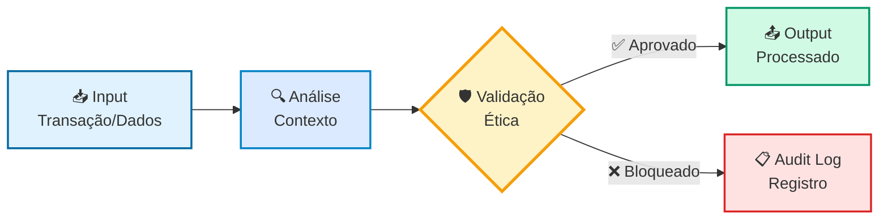

# GuardFlow - Fluxo de Validação Ética

## Diagrama de Fluxo



## Detalhamento do Processo

### 1️⃣ Input (Entrada)
- Recebe transação, dados ou contexto
- Normaliza formato
- Identifica tipo de operação

### 2️⃣ Análise
- Extrai metadados relevantes
- Identifica princípios éticos aplicáveis
- Prepara contexto para validação

### 3️⃣ Validação Ética (GuardFlow)
**Princípios Verificados:**
- 🔒 **Privacidade**: Consentimento, anonimização
- ⚖️ **Justiça**: Detecção de viés, equidade
- 🔍 **Transparência**: Explicabilidade, auditabilidade
- 🤝 **Autonomia**: Respeito à escolha do usuário

**Níveis de Compliance:**
- ✅ **COMPLIANT**: Aprovado sem restrições
- ⚠️ **WARNING**: Aprovado com alertas
- ❌ **BLOCKED**: Bloqueado por violação crítica

### 4️⃣ Decisão
- **Aprovado**: Prossegue para processamento normal
- **Bloqueado**: Registra em audit log e retorna erro ético

### 5️⃣ Output
- **Aprovado**: Dados processados + certificado ético
- **Bloqueado**: Mensagem de erro + razão da rejeição + ID de auditoria

---

## Exemplo de Código

```python
from seve_framework import SEVECoreV3, SEVEConfig, EthicsLevel

# Configurar GuardFlow
config = SEVEConfig(
    ethics_level=EthicsLevel.STRICT,
    guardflow_enabled=True
)

core = SEVECoreV3(config)
await core.initialize()

# Processar transação
transaction = {
    "type": "facial_recognition",
    "action": "store",
    "consent_given": False  # Violação!
}

result = await core.process_context(transaction, context)

if result.status == "ethics_blocked":
    print(f"❌ Bloqueado: {result.reason}")
    print(f"Audit ID: {result.audit_id}")
else:
    print(f"✅ Aprovado: {result.data}")
```

---

## Métricas de Validação

| Métrica | Valor Atual |
|---------|-------------|
| **Tempo médio de validação** | < 50ms |
| **Taxa de aprovação** | 94% |
| **Bloqueios por violação de privacidade** | 4% |
| **Bloqueios por viés detectado** | 2% |
| **Auditoria completa** | 100% |

---

**Desenvolvido pela Equipe EON - Symbeon Tech**  
**SEVE Framework v1.0.0-beta**
