# SEVE Framework v1.0.0 — Presentation Overview

> **Symbiotic Ethical Vision Engine**  
> IA ética, modular e universal para múltiplos domínios

---

## 1. Visão Geral

| Item | Detalhe |
|------|---------|
| Nome | **SEVE Framework** (Symbiotic Ethical Vision Engine) |
| Versão | **1.0.0** |
| Licença | Apache-2.0 (núcleo) + Symbeon Vault (módulos premium) |
| Stack | Python 3.11, FastAPI, PyTorch, OpenCV, Hardhat + Solidity |
| Diferencial | Ética embarcada, domínio universal, empatia computacional, arquitetura modular |
| Inspiração Metodológica | **SiD Framework** — Energy & Materials, Life, Society, Individual |

---

## 2. Proposta de Valor

1. **Ética por design**: GuardFlow + UniversalEthicsEngine (LGPD, GDPR, AI Act)
2. **Adaptação Universal**: 8 domínios prontos (Healthcare, Education, Business, etc.)
3. **Empatia Computacional**: UniversalEmpathyEngine com adaptação cultural
4. **Arquitetura Modular**: 5 módulos independentes (Core, Vision, Sense, Ethics, Link)
5. **Blockchain Ready**: SEVEToken (ERC-20), SEVEProtocol (licensing), SEVEDAO (governança)
6. **Documentação Enterprise**: ADRs, testes, benchmarks, guias de deploy, brandbook

---

## 3. Arquitetura

```mermaid
flowchart TD
    subgraph Universal
        SUC(SEVEUniversalCore)
        UE(UniversalEthics)
        UM(UniversalEmpathy)
        DA(Adapters 8x)
    end
    subgraph Core
        V3(SEVECoreV3)
        Vision(SEVE-Vision)
        Sense(SEVE-Sense)
        Ethics(GuardFlow)
        Link(SEVE-Link)
    end
    SUC -->|Context| V3
    V3 --> Vision
    V3 --> Sense
    Ethics -->|Policies| UE
    UE -->|Score + Recomendações| Ethics
    SUC --> UM
    UM -->|Message| V3
    DA --> SUC
```

---

## 4. Módulos Principais

| Módulo | Função | Status |
|--------|--------|--------|
| `seve_framework.core` | Orquestra visão, sense e universal | ✅ |
| `seve_framework.universal.core` | Adaptação multi-domínio | ✅ |
| `seve_framework.universal.adapters` | 8 adaptadores prontos + registry | ✅ |
| `seve_framework.universal.empathy` | Empatia computacional | ✅ |
| `seve_framework.universal.ethics` | Ética universal | ✅ |
| `seve_framework.ethics` | GuardFlow (políticas críticas) | ✅ |
| `seve_framework.vision` | Computer Vision sem identificação | ✅ |
| `seve_framework.sense` | Dados sensor/comportamento | 🔄 |
| `seve_framework.link` | Conectividade segura (REST/Webhooks) | ✅ |

---

## 5. Benchmarks (v1.0.0)

| Métrica | Resultados |
|---------|------------|
| Vision GPU (RTX 3060) | **18.5 ms/img**, 54 img/s |
| Vision CPU | 149 ms/img |
| Ethics Engine | 78 ms (Universal + GuardFlow) |
| REST API (wrk, 2 CPU) | **820 req/s**, p95 = 212 ms |
| Uso de Recursos | CPU 81 %, RAM 3.3 GB, GPU 58 % |

---

## 6. Roadmap

1. **v1.1 — Q2**  
   • Sense Module finalizado  
   • Testes E2E + Cobertura > 80 %  
   • Deploy CI/CD GitHub Actions
2. **v1.2 — Q3**  
   • Plugins de domínio custom  
   • Modo Edge (Raspberry/Jetson)  
   • DAO on-chain
3. **v2.0 — Q4**  
   • Coaching Empático em tempo real  
   • Certificação ESG automatizada  
   • App Mobile SDK

---

## 7. Custo Estimado vs Valor Entregue

| Item | Meses-homem | Custo (USD) |
|------|-------------|-------------|
| Núcleo + Visão | 7 | 280 k |
| Universal Core + Adapters | 8 | 320 k |
| Empatia + Universal Ethics | 6 | 240 k |
| Blockchain + Tokenomics | 3 | 120 k |
| Documentação Enterprise | 3 | 120 k |
| QA, Benchmarks, CI/CD | 2 | 80 k |
| **Total** | **29** | **1.16 M** |

> **Valor de mercado pessoal**: R$ 350 k – R$ 1,2 M (US$ 70k – US$ 240k) como IP + autoridade técnica.

---

## 8. Próximas Ações Comerciais

- **Licenciamento por Nicho** (Healthcare/Education/Retail)  
  • Fee mensal por uso + suporte ético  
- **Consultoria AI + Ethics**  
  • Workshops e auditorias  
- **Pilotos HYBRID / Testnet**  
  • Prova de valor em 30 dias

---

## 9. Contato

- **Site**: <https://seve-framework.ai>  
- **GitHub**: <https://github.com/symbeon/seve-framework>  
- **Discord/Telegram**: <https://community.seve-framework.ai>

