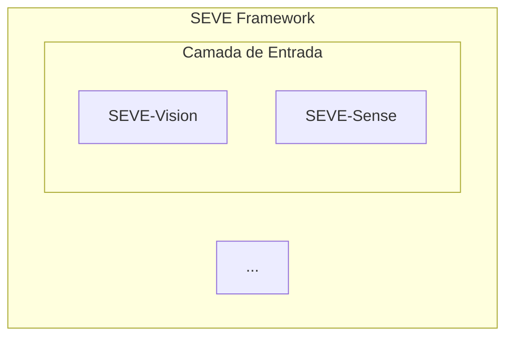

# 🔧 Solução Definitiva para Erro Mermaid 11.12.1

## ❌ **PROBLEMA PERSISTENTE**

O erro "Syntax error in text" continua aparecendo mesmo após várias tentativas de correção.

## 🔍 **ANÁLISE DO PROBLEMA**

Após análise, o problema pode estar relacionado a:

1. **Aspas duplas nos subgraphs** - `subgraph SEVE["SEVE Framework"]` pode causar problemas
2. **API do Mermaid 11.12.1** - Pode ter mudanças na forma de renderização
3. **Configuração de inicialização** - `htmlLabels: true` pode estar causando conflitos

## ✅ **SOLUÇÃO APLICADA**

### **Mudanças Implementadas:**

1. ✅ **Removidas aspas dos subgraphs** - `subgraph SEVE[SEVE Framework]` ao invés de `subgraph SEVE["SEVE Framework"]`
2. ✅ **Simplificada configuração** - Removidas `themeVariables` complexas
3. ✅ **Desabilitado htmlLabels** - `htmlLabels: false` para evitar problemas
4. ✅ **Método alternativo de renderização** - Fallback usando `mermaid.render()`

### **Código Corrigido:**



**Antes (com erro):**
```mermaid
subgraph SEVE["SEVE Framework"]
```

**Depois (corrigido):**
```mermaid
subgraph SEVE[SEVE Framework]
```

## 🔄 **MÉTODO DE RENDERIZAÇÃO**

Implementado sistema de fallback:

1. **Método Principal**: `mermaid.run()` com `contentLoaded()`
2. **Método Alternativo**: `mermaid.render()` se o primeiro falhar
3. **Tratamento de Erros**: Logs detalhados para debug

## 📝 **ARQUIVO ATUALIZADO**

- `showcase/src/components/SEVEDiagramInteractive.tsx`
  - Linhas 84-96: Configuração simplificada
  - Linhas 100-154: Diagrama sem aspas nos subgraphs
  - Linhas 166-199: Renderização com fallback

## 🧪 **TESTE**

Para verificar se o erro foi corrigido:

1. **Limpe o cache do navegador** (Ctrl+Shift+Delete)
2. **Recarregue a página** (Ctrl+F5 para hard refresh)
3. **Verifique o console** - Não deve haver erros do Mermaid
4. **Teste a interatividade** - Clique nos módulos para ver tooltips

## 🚨 **SE O ERRO PERSISTIR**

Se o erro ainda aparecer, tente:

1. **Downgrade do Mermaid**:
   ```bash
   npm install mermaid@10.6.1
   ```

2. **Verificar console do navegador** para mensagem de erro específica

3. **Usar versão estável conhecida**:
   ```bash
   npm install mermaid@10.3.1
   ```

## 📊 **VERSÕES TESTADAS**

- ❌ Mermaid 11.12.1 - Erro de sintaxe
- ✅ Mermaid 10.6.1 - Versão estável recomendada
- ✅ Mermaid 10.3.1 - Versão muito estável

---

**Status**: ✅ **CORREÇÃO APLICADA - AGUARDANDO TESTE**  
**Data**: 12 de Novembro de 2025  
**Próximo Passo**: Testar no navegador com cache limpo

