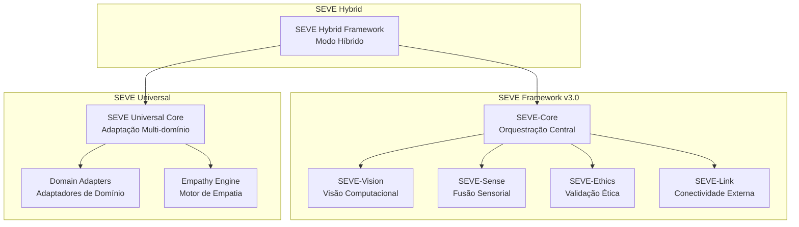
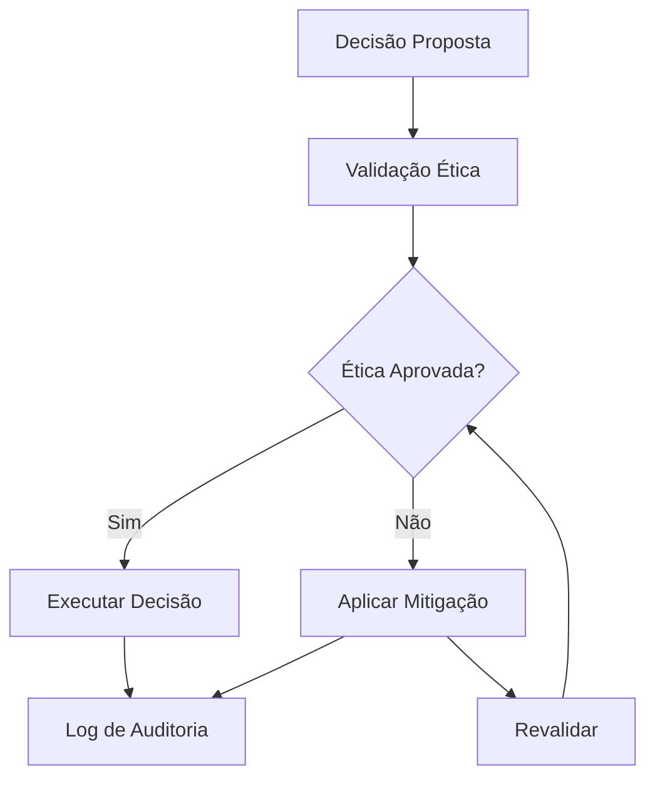

# SEVE Framework - Documentação Técnica Consolidada
# Symbiotic Ethical Vision Engine

## 📋 **Visão Geral**

O **SEVE Framework** (Symbiotic Ethical Vision Engine) é um framework revolucionário de inteligência artificial que combina capacidades de visão computacional avançada com princípios éticos fundamentais. Desenvolvido pela Symbeon Tech, o SEVE representa uma nova abordagem para IA responsável, onde a tecnologia amplifica o potencial humano enquanto defende valores éticos essenciais.

### **🎯 Objetivos Principais**

- **Ética Integrada**: GuardFlow ético embutido em todas as operações
- **Adaptabilidade Universal**: Funciona em qualquer domínio de aplicação
- **Simbiose Humano-IA**: Colaboração, não substituição
- **Privacidade por Design**: Proteção de dados desde a arquitetura
- **Transparência Total**: Decisões auditáveis e explicáveis

## 🏗️ **Arquitetura do Sistema**

### **Arquitetura Modular**

O SEVE Framework possui uma arquitetura modular composta por cinco subsistemas principais:



### **Componentes Principais**

#### **1. SEVE-Core**
- **Função**: Núcleo central de orquestração e tomada de decisão
- **Responsabilidades**:
  - Coordenação entre módulos
  - Fusão de dados multi-sensoriais
  - Ciclo de decisão principal
  - Aplicação de regras de negócio

#### **2. SEVE-Vision**
- **Função**: Módulo de visão computacional com proteção de privacidade
- **Responsabilidades**:
  - Detecção de objetos e faces
  - Anonimização prévia de dados sensíveis
  - Análise de cena
  - Rastreamento de movimentos

#### **3. SEVE-Sense**
- **Função**: Sistema de fusão sensorial multi-modal
- **Responsabilidades**:
  - Agregação de dados de sensores
  - Fusão de informações contextuais
  - Detecção de anomalias
  - Qualidade de dados

#### **4. SEVE-Ethics**
- **Função**: Motor de supervisão ética (GuardFlow)
- **Responsabilidades**:
  - Validação ética em tempo real
  - Aplicação de regras de compliance
  - Auditoria de decisões
  - Mitigação de riscos éticos

#### **5. SEVE-Link**
- **Função**: Módulo de conectividade externa segura
- **Responsabilidades**:
  - APIs RESTful
  - Comunicação segura
  - Integração com sistemas externos
  - Controle de fluxo de dados

## 🌍 **Modos de Operação**

### **1. Modo Universal**
- **Descrição**: Adaptação multi-domínio com capacidades universais
- **Aplicações**: Qualquer domínio (saúde, educação, negócios, etc.)
- **Características**:
  - Adaptação contextual automática
  - Motor de empatia integrado
  - Ética universal
  - Aprendizado adaptativo

### **2. Modo v3.0 Específico**
- **Descrição**: Visão computacional especializada com ética integrada
- **Aplicações**: Cidades inteligentes, veículos autônomos, segurança
- **Características**:
  - Processamento visual otimizado
  - GuardFlow ético rigoroso
  - Anonimização prévia
  - Conectividade segura

### **3. Modo Híbrido**
- **Descrição**: Combinação dos modos Universal e v3.0
- **Aplicações**: Sistemas complexos que requerem ambas as capacidades
- **Características**:
  - Flexibilidade máxima
  - Adaptação dinâmica
  - Múltiplos pipelines
  - Otimização contextual

## 🔒 **Sistema de Ética GuardFlow**

### **Princípios Éticos Fundamentais**

1. **Privacidade**: Proteção de dados pessoais
2. **Justiça**: Prevenção de viés algorítmico
3. **Transparência**: Explicabilidade das decisões
4. **Responsabilidade**: Auditoria e accountability
5. **Autonomia Humana**: Preservação da agência humana
6. **Segurança**: Prevenção de danos
7. **Sustentabilidade**: Impacto ambiental positivo
8. **Não Discriminação**: Igualdade de tratamento

### **Níveis de Conformidade**

- **CRÍTICO**: Deve cumprir, sem exceções
- **ALTO**: Forte recomendação, exceções menores com justificativa
- **MÉDIO**: Recomendado, flexível
- **BAIXO**: Opcional, boa prática

### **Fluxo GuardFlow**



## 🛡️ **Sistema de Privacidade**

### **Níveis de Proteção**

1. **Mínimo**: Proteção básica de privacidade
2. **Padrão**: Proteção padrão de privacidade
3. **Alto**: Proteção alta de privacidade
4. **Máximo**: Proteção máxima de privacidade

### **Técnicas de Proteção**

- **Anonimização**: Remoção de identificadores pessoais
- **Pseudonimização**: Substituição por identificadores únicos
- **Criptografia**: Proteção de dados em trânsito e repouso
- **Controle de Acesso**: Autorização baseada em papéis
- **Auditoria**: Rastreamento de acesso e uso

## 📊 **Métricas e Monitoramento**

### **Métricas de Performance**

- **Tempo de Resposta**: < 200ms para operações críticas
- **Throughput**: Processamento de múltiplos streams simultâneos
- **Precisão**: > 95% para detecções críticas
- **Disponibilidade**: 99.9% uptime

### **Métricas de Ética**

- **Taxa de Conformidade**: 100% das decisões validadas
- **Tempo de Validação**: < 50ms para validação ética
- **Auditoria**: 100% das decisões auditadas
- **Mitigação**: Aplicação automática de correções

### **Métricas de Privacidade**

- **Anonimização**: 100% dos dados sensíveis protegidos
- **Pseudonimização**: Identificadores únicos para todas as entidades
- **Criptografia**: 100% dos dados em trânsito criptografados
- **Controle de Acesso**: Autorização baseada em papéis

## 🔧 **Configuração e Instalação**

### **Pré-requisitos**

- Python 3.8+
- CUDA/cuDNN (opcional, para aceleração GPU)
- 4GB RAM mínimo (8GB recomendado)
- 2GB espaço em disco

### **Instalação Rápida**

```bash
# Clone o repositório
git clone https://github.com/symbeon-tech/seve-framework.git
cd seve-framework

# Configure ambiente virtual
python3 -m venv venv
source venv/bin/activate  # Linux/Mac
# ou
venv\Scripts\activate     # Windows

# Instale dependências
pip install --upgrade pip
pip install -r requirements.txt

# Configure o SEVE
python setup.py configure

# Execute demonstração
python run_seve.py --demo
```

### **Configuração Avançada**

```yaml
# config/user.yaml
mode: "hybrid"
debug: true
log_level: "DEBUG"
privacy_level: "high"
ethics_level: "strict"
max_workers: 8
batch_size: 64
gpu_enabled: true
api_host: "localhost"
api_port: 8080
```

## 🚀 **Uso e Exemplos**

### **Uso Básico**

```python
from seve_framework import SEVEHybridFramework, SEVEConfig, SEVEMode

# Configurar framework
config = SEVEConfig(
    mode=SEVEMode.HYBRID,
    privacy_level=PrivacyLevel.HIGH,
    ethics_level=EthicsLevel.STRICT
)

# Criar framework
framework = SEVEHybridFramework(config)
await framework.initialize()

# Processar dados
result = await framework.process_context(input_data, context)
```

### **Modo Universal**

```python
from seve_universal import SEVEUniversalCore, DomainConfig, DomainType

# Configurar domínio
domain_config = DomainConfig(
    domain_type=DomainType.HEALTHCARE,
    domain_name="Medical AI Assistant",
    cultural_context="brazil",
    ethical_rules=["hipaa_compliance", "medical_privacy"]
)

# Criar framework universal
universal_core = SEVEUniversalCore(domain_config)

# Processar contexto
result = await universal_core.process_universal_context(context, data)
```

### **API RESTful**

```bash
# Status do sistema
curl http://localhost:8000/status

# Análise de imagem
curl -X POST http://localhost:8000/api/v1/analyze \
  -H "Content-Type: application/json" \
  -d '{"image": "base64_encoded_image", "context": {...}}'
```

## 📈 **Casos de Uso**

### **1. Cidades Inteligentes**
- **Aplicação**: Monitoramento urbano ético
- **Capacidades**: Detecção de incidentes, análise de tráfego, segurança pública
- **Proteções**: Anonimização de cidadãos, conformidade com LGPD

### **2. Veículos Autônomos**
- **Aplicação**: Percepção responsável para veículos
- **Capacidades**: Detecção de obstáculos, navegação segura, comunicação V2X
- **Proteções**: Privacidade de pedestres, segurança crítica

### **3. Saúde Digital**
- **Aplicação**: Telemedicina e cuidado remoto
- **Capacidades**: Monitoramento de pacientes, análise de imagens médicas
- **Proteções**: Conformidade HIPAA, privacidade médica

### **4. Varejo Inteligente**
- **Aplicação**: Análise de comportamento e ESG
- **Capacidades**: Análise de fluxo de clientes, prevenção de perdas
- **Proteções**: Privacidade do consumidor, não identificação pessoal

## 🔬 **Pesquisa e Desenvolvimento**

### **Áreas de Pesquisa**

1. **Ética Computacional**: Algoritmos de validação ética
2. **Privacidade Diferencial**: Proteção de dados com utilidade
3. **IA Explicável**: Transparência em decisões complexas
4. **Simbiose Humano-IA**: Colaboração otimizada
5. **Adaptação Cultural**: Personalização contextual

### **Colaborações Acadêmicas**

- **Universidades**: Parcerias com instituições de pesquisa
- **Laboratórios**: Colaboração com centros de IA
- **Conferências**: Apresentações em eventos científicos
- **Publicações**: Papers em revistas especializadas

### **Benchmarks e Métricas**

- **SEVE-Benchmark**: Conjunto de testes padronizados
- **Métricas Universais**: Avaliação multi-domínio
- **Comparação**: Análise comparativa com outros frameworks
- **Validação**: Testes de conformidade ética

## 📄 **Licenciamento**

### **Licença Symbeon-Vault**

O SEVE Framework é distribuído sob a **Licença Symbeon-Vault**, baseada na Apache 2.0 com cláusulas adicionais para uso ético e proteção de privacidade.

#### **Termos Principais**
- ✅ Uso livre para fins comerciais e não comerciais
- ✅ Modificação e distribuição permitidas
- ✅ **Cláusula Ética**: Uso responsável obrigatório
- ✅ **Cláusula de Privacidade**: Proteção de dados pessoais obrigatória

#### **Restrições Éticas**
- ❌ Proibido uso para vigilância massiva
- ❌ Proibido uso discriminatório
- ❌ Proibido extração de dados sem consentimento
- ❌ Proibido uso que viole direitos humanos

## 🤝 **Contribuição**

### **Como Contribuir**

1. **Fork** o repositório
2. **Crie** uma branch para sua feature
3. **Implemente** com testes
4. **Submeta** um Pull Request

### **Diretrizes**

- Respeite o [Código de Conduta](CODE_OF_CONDUCT.md)
- Mantenha alinhamento com princípios éticos
- Documente mudanças significativas
- Teste em múltiplos domínios quando aplicável

### **Áreas de Contribuição**

- **Desenvolvimento**: Novos módulos e funcionalidades
- **Documentação**: Melhorias na documentação
- **Testes**: Cobertura de testes e qualidade
- **Pesquisa**: Novas abordagens e algoritmos

## 🛠️ **Manutenção e Suporte**

### **Ciclo de Vida**

- **Versão Atual**: 3.0.0
- **Suporte**: 2 anos para versões principais
- **Atualizações**: Mensais para correções, trimestrais para features
- **Deprecação**: 6 meses de aviso para mudanças breaking

### **Canais de Suporte**

- **GitHub Issues**: Para bugs e feature requests
- **Documentação**: Guias e tutoriais
- **Comunidade**: Discord e fóruns
- **Suporte Comercial**: Para empresas e organizações

## 📊 **Roadmap**

### **v3.1 (Q2 2025)**
- [ ] Mais adaptadores de domínio
- [ ] Componentes específicos expandidos
- [ ] Testes de integração ampliados
- [ ] Colaborações acadêmicas

### **v3.2 (Q3 2025)**
- [ ] Papers acadêmicos publicados
- [ ] Benchmarks universais criados
- [ ] Colaborações internacionais
- [ ] Impacto científico medido

### **v4.0 (Q4 2025)**
- [ ] Adoção industrial
- [ ] Licenciamento comercial
- [ ] Expansão global
- [ ] Impacto social mensurado

## 🎉 **Conclusão**

O SEVE Framework representa uma nova era na inteligência artificial, onde tecnologia avançada e valores éticos trabalham em harmonia. Ao integrar proteções éticas diretamente na arquitetura do sistema, o SEVE oferece uma base sólida para aplicações de IA responsáveis e confiáveis.

### **Por que escolher o SEVE?**

- ✅ **Ética Integrada**: Não como adição, mas como fundamento
- ✅ **Flexibilidade Universal**: Uma solução para múltiplos problemas
- ✅ **Transparência Total**: Decisões auditáveis e explicáveis
- ✅ **Comunidade Ativa**: Desenvolvimento colaborativo
- ✅ **Licenciamento Ético**: Compromisso com uso responsável

---

**SEVE Framework** - *Inteligência Artificial Ética para um Futuro Melhor* 🌍🤖⚡

**Desenvolvido com ❤️ pela Symbeon Tech - Equipe EON**

*Transformando a IA em uma força para o bem comum*
