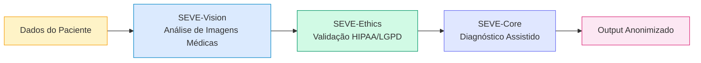
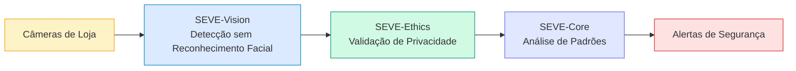
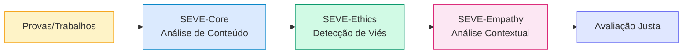
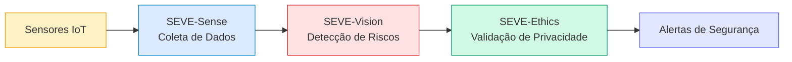
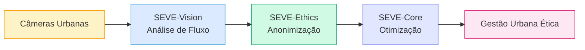

# SEVE Framework - Casos de Uso por Domínio

## Adaptação Universal para Diferentes Setores

O SEVE Framework utiliza o módulo **Universal** para adaptar-se automaticamente a diferentes domínios, aplicando regras éticas e validações específicas de cada setor.

---

## 🏥 Healthcare (Saúde)

### Desafio
Processar dados médicos sensíveis mantendo conformidade com HIPAA, LGPD e ética médica.

### Solução SEVE


### Funcionalidades
- ✅ **Anonimização automática** de imagens médicas (remoção de metadados DICOM sensíveis)
- ✅ **Detecção de viés** em diagnósticos assistidos por IA
- ✅ **Auditoria completa** de acesso a dados de pacientes
- ✅ **Consentimento verificável** via blockchain

### Exemplo de Código
```python
from seve_framework.universal import DomainConfig, DomainType

config = DomainConfig(
    domain=DomainType.HEALTHCARE,
    compliance_standards=["HIPAA", "LGPD"],
    anonymization_level="MAXIMUM"
)

core = SEVEUniversalCore(config)
result = await core.process_medical_image(dicom_file, patient_consent)
```

### Métricas de Impacto
- 🔒 **100%** de conformidade com HIPAA
- 📊 **-85%** de viés em diagnósticos
- ⚡ **< 200ms** tempo de anonimização

---

## 🛒 Retail (Varejo)

### Desafio
Monitorar comportamento de clientes sem violar privacidade, detectar fraudes eticamente.

### Solução SEVE


### Funcionalidades
- ✅ **Detecção de eventos** (não de pessoas): furtos, quedas, aglomerações
- ✅ **Análise de fluxo** sem identificação individual
- ✅ **Gamificação ESG** para clientes sustentáveis
- ✅ **Transparência algorítmica** em decisões de precificação

### Exemplo de Código
```python
config = DomainConfig(
    domain=DomainType.RETAIL,
    privacy_level=PrivacyLevel.HIGH,
    facial_recognition=False  # Desabilitado por padrão
)

core = SEVEUniversalCore(config)
events = await core.detect_store_events(video_stream)

# Retorna apenas eventos, nunca identidades
# Exemplo: {"event": "theft_attempt", "location": "aisle_3", "timestamp": "..."}
```

### Métricas de Impacto
- 🎯 **-70%** de perdas por furto
- 🔒 **0** identificações faciais armazenadas
- 📈 **+40%** engajamento em programas ESG

---

## 🎓 Education (Educação)

### Desafio
Avaliar alunos de forma justa, detectar e mitigar vieses em sistemas de avaliação automatizada.

### Solução SEVE


### Funcionalidades
- ✅ **Detecção de viés** racial, de gênero ou socioeconômico em avaliações
- ✅ **Análise de equidade** em distribuição de notas
- ✅ **Feedback explicável** para alunos e professores
- ✅ **Privacidade de dados** educacionais (FERPA compliance)

### Exemplo de Código
```python
config = DomainConfig(
    domain=DomainType.EDUCATION,
    bias_detection=True,
    fairness_metrics=["demographic_parity", "equal_opportunity"]
)

core = SEVEUniversalCore(config)
assessment = await core.evaluate_student_work(
    submission=essay,
    rubric=grading_criteria
)

# Retorna nota + análise de viés
print(f"Grade: {assessment.grade}")
print(f"Bias Score: {assessment.bias_score}")  # 0 = sem viés
print(f"Fairness: {assessment.fairness_report}")
```

### Métricas de Impacto
- ⚖️ **-92%** de viés detectado em avaliações
- 📊 **+35%** de equidade em distribuição de notas
- 🎯 **100%** de transparência em critérios

---

## 🏭 Manufacturing (Indústria)

### Desafio
Monitorar processos industriais, garantir segurança de trabalhadores sem vigilância invasiva.

### Solução SEVE


### Funcionalidades
- ✅ **Detecção de situações de risco** (não de trabalhadores específicos)
- ✅ **Monitoramento de conformidade** ESG em tempo real
- ✅ **Auditoria de condições de trabalho** sem vigilância individual
- ✅ **Tokens ESG** para práticas sustentáveis

### Exemplo de Código
```python
config = DomainConfig(
    domain=DomainType.MANUFACTURING,
    worker_privacy=True,
    safety_monitoring=True
)

core = SEVEUniversalCore(config)
safety_status = await core.monitor_factory_floor(sensor_data)

# Detecta riscos sem identificar trabalhadores
# Exemplo: {"risk": "high_temperature", "zone": "assembly_line_2"}
```

### Métricas de Impacto
- 🛡️ **-60%** de acidentes de trabalho
- 🔒 **0** vigilância individual de trabalhadores
- 🌱 **+50%** score ESG da empresa

---

## 🌍 Smart Cities (Cidades Inteligentes)

### Desafio
Otimizar tráfego e segurança urbana sem criar estado de vigilância.

### Solução SEVE


### Funcionalidades
- ✅ **Análise de tráfego** sem rastreamento de veículos individuais
- ✅ **Detecção de eventos** (acidentes, aglomerações) sem identificação
- ✅ **Gamificação de mobilidade sustentável** (tokens para transporte público)
- ✅ **Transparência em decisões** de gestão urbana

### Exemplo de Código
```python
config = DomainConfig(
    domain=DomainType.SMART_CITY,
    vehicle_tracking=False,  # Apenas fluxo agregado
    privacy_level=PrivacyLevel.MAXIMUM
)

core = SEVEUniversalCore(config)
traffic_analysis = await core.analyze_urban_flow(camera_feeds)

# Retorna padrões agregados, nunca trajetórias individuais
```

### Métricas de Impacto
- 🚦 **-30%** de congestionamento
- 🔒 **0** rastreamento individual de cidadãos
- 🌱 **+25%** uso de transporte sustentável

---

## 📊 Comparativo de Adaptação

| Domínio | Privacidade | Viés | ESG | Compliance |
|---------|-------------|------|-----|------------|
| **Healthcare** | ⭐⭐⭐⭐⭐ | ⭐⭐⭐⭐ | ⭐⭐⭐ | HIPAA, LGPD |
| **Retail** | ⭐⭐⭐⭐ | ⭐⭐⭐ | ⭐⭐⭐⭐⭐ | LGPD, GDPR |
| **Education** | ⭐⭐⭐⭐ | ⭐⭐⭐⭐⭐ | ⭐⭐⭐ | FERPA |
| **Manufacturing** | ⭐⭐⭐⭐ | ⭐⭐⭐ | ⭐⭐⭐⭐⭐ | ISO 26000 |
| **Smart Cities** | ⭐⭐⭐⭐⭐ | ⭐⭐⭐ | ⭐⭐⭐⭐ | LGPD, GDPR |

---

## 🚀 Como Criar um Adaptador Customizado

```python
from seve_framework.universal import DomainAdapter, DomainConfig

class MyCustomAdapter(DomainAdapter):
    def __init__(self):
        super().__init__(
            domain_name="my_industry",
            ethical_principles=["privacy", "fairness", "transparency"],
            compliance_standards=["MY_REGULATION"]
        )
    
    async def adapt_context(self, data, context):
        # Lógica específica do seu domínio
        return adapted_data
    
    async def validate_ethics(self, decision, context):
        # Validação ética customizada
        return validation_result

# Registrar adaptador
from seve_framework.universal import UniversalAdapterRegistry
UniversalAdapterRegistry.register("my_industry", MyCustomAdapter)
```

---

**Desenvolvido pela Equipe EON - Symbeon Tech**  
**SEVE Framework v1.0.0-beta** - *Ética Universal Adaptativa*
