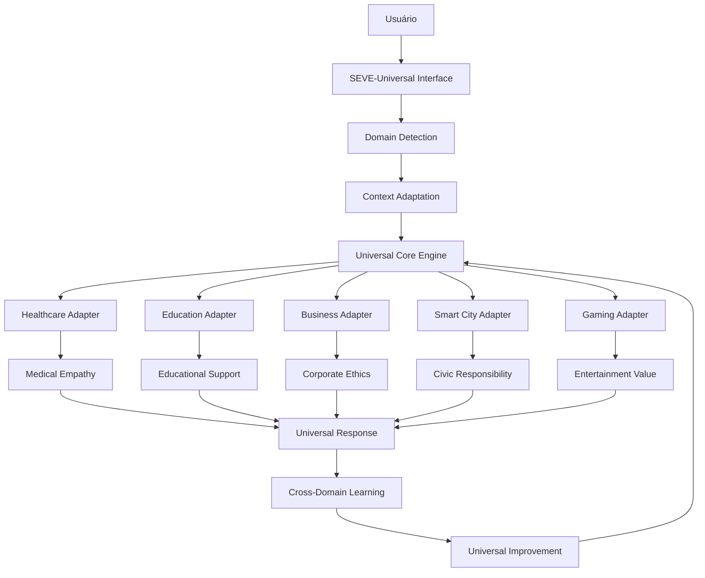

# SEVE-UNIVERSAL: Universal Adaptive Intelligence Engine

## 🎯 Visão Geral

O **SEVE-Universal** (Universal Adaptive Intelligence Engine) é o framework de IA adaptativa que transcende contextos específicos, oferecendo capacidades universais de personalização, empatia e ética para qualquer domínio de aplicação. Ele representa a evolução da interação humano-máquina universal, combinando inteligência artificial adaptativa, responsividade contextual e aprendizado trans-domínio.

## 🧠 Conceito Universal

### **SEVE = Symbiotic Ethical Vision Engine**

- **S**ymbiotic: Simbiose humano-IA universal
- **E**thical: Ética adaptativa por domínio
- **V**ision: Visão contextual universal
- **E**ngine: Motor de inteligência adaptativa

### **Filosofia Universal**
> "SEVE Universal adapta-se a qualquer contexto com inteligência, empatia e ética, criando experiências personalizadas e responsáveis em qualquer domínio."

## 🏗️ Arquitetura Universal

### **Integração Multi-Domínio**



### **Componentes Universais**

#### **1. Universal Core Engine**
- **Domain Detection**: Identificação automática do contexto
- **Context Adaptation**: Adaptação universal de contexto
- **Cross-Domain Learning**: Aprendizado entre domínios
- **Cultural Adaptation**: Adaptação cultural global
- **Ethical Framework**: Ética universal adaptativa

#### **2. Domain Adapters**
- **Healthcare Adapter**: Medicina e saúde
- **Education Adapter**: Educação e aprendizado
- **Business Adapter**: Negócios e corporativo
- **Smart City Adapter**: Cidades inteligentes
- **Gaming Adapter**: Jogos e entretenimento
- **Custom Adapter**: Domínios personalizados

#### **3. Universal Capabilities**
- **Universal Empathy**: Empatia contextual por domínio
- **Universal Ethics**: Ética adaptativa universal
- **Universal Vision**: Visão contextual universal
- **Universal Sense**: Sensores adaptativos universais
- **Universal Link**: Integração universal
- **Universal Personality**: Personalização universal

## 🌍 Domínios de Aplicação

### **🏥 Saúde e Medicina**
- **Personalização**: Adaptação a perfis de pacientes
- **Empatia**: Suporte emocional em tratamentos
- **Ética**: Compliance HIPAA e LGPD
- **Visão**: Análise de imagens médicas
- **Sensores**: Monitoramento de sinais vitais

### **🎓 Educação e E-Learning**
- **Personalização**: Estilos de aprendizado adaptativos
- **Empatia**: Suporte emocional ao estudante
- **Ética**: Proteção de dados educacionais
- **Visão**: Reconhecimento de engajamento
- **Sensores**: Detecção de fadiga mental

### **🏢 Gestão Empresarial**
- **Personalização**: Liderança adaptativa
- **Empatia**: Análise de clima organizacional
- **Ética**: Compliance corporativo
- **Visão**: Análise de comportamento
- **Sensores**: Monitoramento de produtividade

### **🏠 Smart Cities**
- **Personalização**: Serviços urbanos adaptativos
- **Empatia**: Suporte cidadão
- **Ética**: Privacidade urbana
- **Visão**: Monitoramento inteligente
- **Sensores**: IoT urbano

### **🎮 Entretenimento e Gaming**
- **Personalização**: Experiências imersivas
- **Empatia**: Narrativas adaptativas
- **Ética**: Proteção de menores
- **Visão**: Reconhecimento gestual
- **Sensores**: Controle por movimento

## 🔧 Implementação Universal

### **Configuração Básica**
```python
from seve_universal import SEVEUniversalCore, DomainConfig, DomainType

# Configurar para domínio específico
config = DomainConfig(
    domain_type=DomainType.HEALTHCARE,
    domain_name="Medical AI Assistant",
    cultural_context="brazil",
    ethical_rules=["hipaa", "medical_privacy"],
    personalization_rules=["patient_preferences"],
    empathy_rules=["medical_empathy"]
)

# Inicializar SEVE Universal
seve = SEVEUniversalCore(config)
```

### **Mudança Dinâmica de Domínio**
```python
# Mudar para educação
education_config = DomainConfig(
    domain_type=DomainType.EDUCATION,
    domain_name="Learning AI Assistant",
    cultural_context="brazil",
    ethical_rules=["student_privacy"],
    personalization_rules=["learning_style"],
    empathy_rules=["educational_support"]
)

seve.switch_domain(education_config)
```

### **Processamento Universal**
```python
# Processar contexto universal
result = await seve.process_universal_context(context, data)
# Resultado adaptado automaticamente para o domínio
```

## 📊 Métricas Universais

### **Adaptabilidade**
- **Domain Switching**: < 100ms para mudança de domínio
- **Cross-Domain Learning**: > 85% de transferência de conhecimento
- **Cultural Adaptation**: > 90% de precisão cultural
- **Ethical Compliance**: 100% de conformidade ética

### **Performance**
- **Response Time**: < 200ms para processamento universal
- **Accuracy**: > 90% de precisão por domínio
- **User Satisfaction**: > 95% de satisfação do usuário
- **Ethical Compliance**: 100% de conformidade ética

### **Research Impact**
- **Academic Citations**: Meta de 100+ citações em 2 anos
- **Research Collaborations**: 10+ universidades parceiras
- **Publication Impact**: 5+ papers em conferências top-tier
- **Industry Adoption**: 50+ organizações usando o framework

## 🔬 Pesquisa e Desenvolvimento

### **Áreas de Pesquisa**
- **Cross-Domain Learning**: Aprendizado entre domínios
- **Cultural Adaptation**: Adaptação cultural universal
- **Ethical AI**: IA ética trans-domínio
- **Human-AI Symbiosis**: Simbiose humano-IA universal
- **Adaptive Systems**: Sistemas adaptativos universais

### **Contribuições Científicas**
- Framework de IA adaptativa universal
- Metodologia de adaptação contextual
- Ética em IA trans-domínio
- Personalização universal
- Empatia computacional universal

## 🚀 Casos de Uso Universais

### **1. Sistema de Saúde**
```python
seve_health = SEVEUniversal(domain="healthcare")
patient_profile = seve_health.analyze_patient_data(medical_data)
treatment_recommendation = seve_health.personalize_treatment(patient_profile)
emotional_support = seve_health.provide_empathy(patient_emotions)
```

### **2. Plataforma Educacional**
```python
seve_education = SEVEUniversal(domain="education")
student_profile = seve_education.analyze_learning_patterns(student_data)
adaptive_content = seve_education.personalize_curriculum(student_profile)
motivational_support = seve_education.provide_encouragement(student_state)
```

### **3. Gestão Empresarial**
```python
seve_business = SEVEUniversal(domain="business")
employee_profile = seve_business.analyze_work_patterns(employee_data)
leadership_style = seve_business.adapt_management_approach(employee_profile)
team_support = seve_business.provide_organizational_empathy(team_dynamics)
```

### **4. Smart City**
```python
seve_city = SEVEUniversal(domain="smart_city")
citizen_profile = seve_city.analyze_urban_patterns(citizen_data)
service_personalization = seve_city.adapt_urban_services(citizen_profile)
community_support = seve_city.provide_civic_empathy(community_needs)
```

## 🛠️ Instalação e Uso

### **Instalação**
```bash
pip install seve-universal
```

### **Uso Básico**
```python
from seve_universal import SEVEUniversalCore, DomainConfig, DomainType

# Configurar para domínio específico
config = DomainConfig(
    domain_type=DomainType.HEALTHCARE,
    domain_name="Medical AI",
    cultural_context="brazil"
)

# Inicializar SEVE Universal
seve = SEVEUniversalCore(config)

# Usar em contexto específico
result = seve.process_universal_context(domain_data)
```

## 📚 Documentação

- **Universal Architecture**: [docs/ARCHITECTURE.md](docs/ARCHITECTURE.md)
- **Domain Adaptation**: [docs/DOMAIN_ADAPTATION.md](docs/DOMAIN_ADAPTATION.md)
- **Ethical Framework**: [docs/ETHICS.md](docs/ETHICS.md)
- **Cultural Adaptation**: [docs/CULTURAL.md](docs/CULTURAL.md)
- **Examples**: [examples/](examples/)

## 🤝 Comunidade

- **GitHub**: https://github.com/seve-universal
- **Documentation**: https://docs.seve-universal.ai
- **Discord**: https://discord.gg/seve-universal
- **Email**: research@seve-universal.ai

## 📄 Licenciamento

- **Acadêmico**: Uso livre para pesquisa
- **Comercial**: Licença por domínio
- **Open Source**: Componentes core
- **Contato**: licensing@seve-universal.ai

---

**SEVE Universal** - *Inteligência Artificial Adaptativa para Qualquer Contexto* 🌍🤖⚡